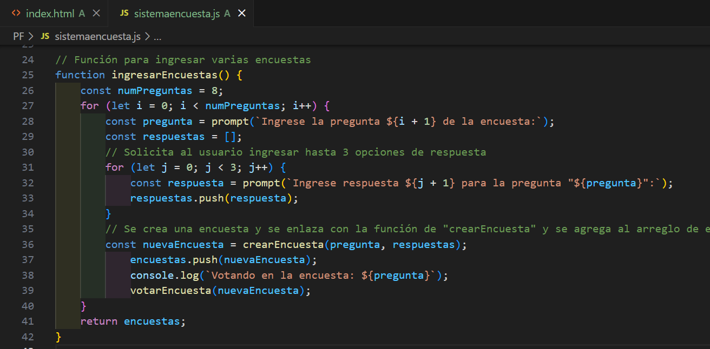

# Módulo 2 - Proyecto 2
## ¡Bienvenidos al proyecto "Sistema de encuestas"!

## Tabla de Contenidos
* [1. Desafío](#1-Desafío)
* [2. Análisis](#2-Análisis)
* [3. Código y explicaciones generales](#4-Código-y-explicaciones-generales)
* [4. Conclusiones](#5-Conclusiones)

****
## Desarrollo

### 1. Desafio
 Para este segundo proyecto se solicita generar en JavaScript un código que permita a los usuarios generar encuestas, votar y ver los resultados. Se debe considerar las siguientes habilidades y conocimientos:
- Aplicación de conceptos básicos de programación en JavaScript.
- Uso de variables, constantes, operadores aritméticos y de comparación.
- Implementación de control de flujo mediante condiciones y bucles.
- Manipulación de estructuras de datos, como objetos y arrays.
- Uso de funciones, funciones de flecha y funciones anónimas.
- Implementación de programación orientada a objetos (POO) o programación funcional (PF).

  ****
  
### 2. Análisis
 En base al desafío planteado, se inicia el análisis y preparación del código considerando los conocimientos detallados en el punto anterior. Se selecciona la opción de desarrollo de programa en Programación Funcional (PF), debido a que gran parte de los ejercicios ejecutados fueron realizados en base a ese paradigma y es el que más he aplicado en los trabajos en clase y en trabajo grupal.

****

### 3. Código y explicaciones generales
 El código fue dividido en bloques de sentencias para su desarrollo, con el fin de revisar los resultados e ir iterando hasta lograr su resultado esperado.
 En primera instancia se procede con la función de crear una encuesta ("crearEncuesta") que considere pregunta y respuestas, como se muestra a continuación:
 
 
 
 Dentro de esa función se incluye un objeto que almacene resultados, el cual inicia con valor "0", en espera de recibir las respuestas. Posteriormente se agrega "return" para que devolvuelva un objeto conteniendo pregunta, respuestas y resultados. Adicionalmente se incluye una función de "votar" para registrar los votos de la encuesta.

 Para que el usuario pueda ingresar encuestas, se habilita una función, considerando un número de preguntas como base mínimo, adicionalmente se le solicita al usuario que ingrese las respuestas posibles por separado. Para proceder con el registro de las respuestas, se agrega el método push para que permita modificar el array de "respuestas", agregando un nuevo elemento al final del mismo.
 Posteriormente se utiliza la función de crearEncuesta para crear una encuesta, se verifica que esta función devuelva un objeto de encuesta válida, luego se agrega una encuesta nueva al arreglo de encuesta, y una vez realizado esto, se indica al usuario que está votando en la encuesta que está ingresando. Al final el bucle, se retornará el arreglo de "encuestas" con la data ingresada en las nuevas encuestas.

 

 Se procede con la función de votar, con el fin de que los usuarios puedan seleccionar la respuesta, votando por una opción en la encuesta creada:
  
  

 Para poder ver los resultados, se presenta la función de "mostrarResultados" que permite visualizar, incluyendo el método for, las respuestas y votos realizados:
 
  

 Para finalizar, se declara una constante de "encuestas" para almacenar data y por último se deja la función para ingresar encuestas inicializada, como se muestra a continuación:

  

  Al ejecutar el código se muestra de la siguiente forma:
  
  

  y resultados de las votaciones:

 
*[Se incluye Link para visualización del Código](./PF)*
  
  ****
  
  ### 5. Conclusiones
 Para la preparación del programa, se dio inicio con una estructura por bloques, que permitiera partir desde la base, en este caso fue por la definición de la función base de creación de encuesta, posterior a eso, se definieron arreglos, además de condiciones que permitieran la evolución del código, además de guardar variables y complejizar la estructura para permitir el ingreso de encuestas con un mínimo de preguntas, a su vez se enlazaron las funciones de votar en las encuestas y además que permitiera mostrar los resultados de las mismas. De lo anteior se debe mencionar que se realizaron varias revisiones del código, hasta lograr su ejecución.
  ****
                                                                           *¡Gracias!*
